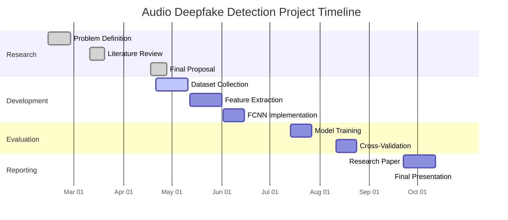

# Self-supervised Audio Deepfake Detection with WavLM and AASIST

[](https://github.com/yourusername/audio-deepfake-detection)
[](https://opensource.org/licenses/MIT)

## 📌 Project Status
🚧 **Under Active Development** 🚧  
This project is currently in development (February - October 2025 timeline). Implementation and evaluation phases are ongoing.

## 🔍 Overview
A robust audio deepfake detection system combining:
- **WavLM**: Self-supervised speech representation model
- **AASIST**: Spectro-temporal graph attention network
- **FCNN Classifier**: Fully connected neural network

## 🎯 Key Features
| Feature | Benefit |
|---------|---------|
| Self-supervised learning | Reduces labeled data dependency |
| Hybrid architecture | Combines WavLM + AASIST strengths |
| Multi-dataset evaluation | ASVspoof, In-The-Wild, ADD datasets |
| Comprehensive metrics | EER, AUC-ROC, F1-score, latency |

<!-- 
## 📂 Repository Structure
audio-deepfake-detection/
├── data/ # Dataset preprocessing
├── models/ # WavLM, AASIST, FCNN
├── training/ # Training scripts
├── evaluation/ # Metrics and testing
├── utils/ # Helper functions
├── docs/ # Documentation
├── LICENSE
└── README.md
-->
## 🛠️ Installation
```bash
git clone https://github.com/yourusername/audio-deepfake-detection.git
cd audio-deepfake-detection
pip install -r requirements.txt
```

## 📅 Project Timeline

